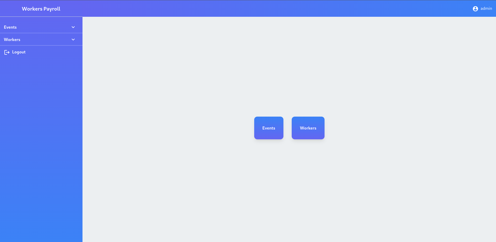

<div align="center">
  <a href="https://github.com/angrysoft/workers-payroll">
    
  </a>

  <h1 align="center">Workers Payroll</h1>
</div>



## Distinctiveness and Complexity

Applications for support payroll management in event/rental company. App has two different view for workers and for administrators:

### Worker View:

* Report - display worker month report
    - Worker can display current month report or display any other date
    - Print report

### Admin View:

* Users - managing users / workers
  * Adding new user
  * Edit user existing user
  * Delete user
  * Edit worker rates 
* Work Scheduler
  - Adding events 
  - Edit events
  - Delete events
  - Adding Event work days 
  - Edit Event work days
  - Delete Event work days
  - Adding worker to event work day

## Backend


On backed application utilize Django:
- django orm - for better and simpler db managements  
- models
- json views
- pyjwt - library for encode and decode jwt tokens

## Frontend


On frontend application utilize javascript
- TypeScript - For catch errors early in editor not in runtime
- React.js - Popular js library for building user interface
- Tailwind css - for better support of css smaller bundle size.

## Files - Folders

- **api** - django app for application api utilized by frontend
    - api/tests.py - tests for api endpoints
    - api/urls.py - main api endpoints
- **frontend** - django app for react frontend
    - frontend/src/ - source files for react frontend part.
        - components/
           - ConfirmDialog.tsx - generic component for confirm actions
           - DateSelector.tsx - component for choosing date of worker month report
           - Dialog.tsx - component for dialog elements
           - Loader.tsx - preloader component
           - Pagination.tsx - component for page pagination
           - elements/ - small component used multiple times
        - hooks/ - react hooks used in components ( helpers for getting / sending data )
        - reducers/ - react reducers for managing global state of application
        - routes - client side routing
        - services/ - helpers services
        - store/ - default values and storage for global app global state

- **payroll** - django app responsible for manage event / event work days
- **screens** - application screenshots
- **workers** - django application responsible for managing workers / users
- **WorkersPayroll** - 
    - backends.py - Simple Json Web Tokens authorization backend
    - decorators.py - view decorators 
        - auth_required - for checking authorization
    - defaults.py - response object for views
    - generic_views.py - GenericListView inherited by other view
- **bootstrap.py** - Create default groups, Functions 
- **gen_data.py** - Generate random users, events ... data for manual testing
- **gen_token.py** - Generate tokens used for jwt and django secrets

## Install Instructions


### Short way - docker:

From main directory run this command to build an image from Dockerfile

```
$ docker build . -t worker
```

And when an image is build run it with this command:

```
$ docker run -p 8000:8000 worker
```

then in your browser go to url [http://0.0.0.0:8000](http://0.0.0.0:8000)

### Longer way:

Install dependencies:

```
pip install -r requirements.txt
```

Make django migrations

```
./manage.py makemigrations workers payroll
./manage.py migrate
```

Crete base worker group / functions

```
./manage.py shell < bootstrap.py
```

Generate example data
```
./manage.py shell < gen_data.py
```

Next we need to build frontend go to frontend dir:

```
cd frontend
```
and with npm install the required dependencies

```
npm install
```

next build 

```
npm run build
```

after build we need to copy files

```
cp -r build/static static/
cp build/index.html templates/
```

and then we can run serwer

```
python manage.py runserver 0.0.0.0:8000
```

then in your browser go to url [http://0.0.0.0:8000](http://0.0.0.0:8000)

